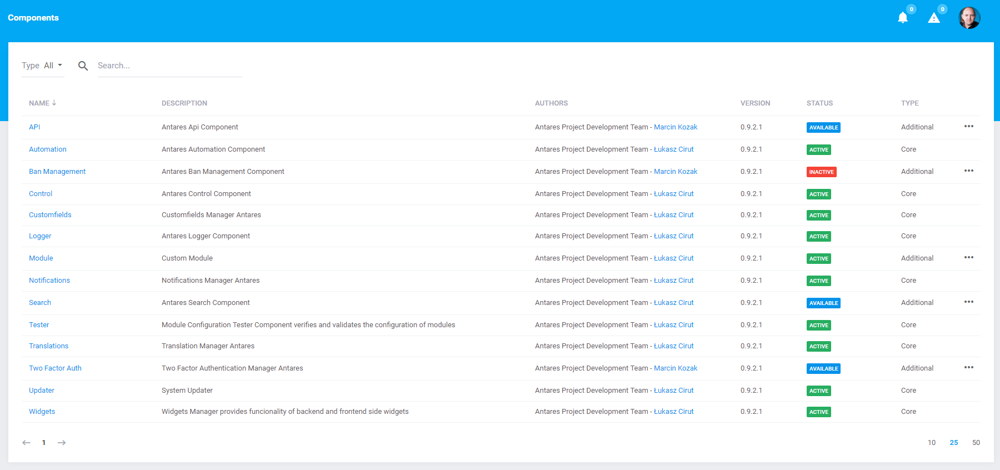
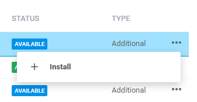
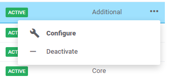

# Components & Modules  

[TOC]

## Structure  

### Minimal Structure
  
A component should consist of the minimal structure:


  
**composer.json** file's content:

```json
{
  "name": "antaresproject/component-example",
  "description": "Antares Example component",
  "type": "antaresproject-component",
  "version": "0.9.2.1",
  "authors": [
    {
      "name": "Your Name",
      "email": "your@contactemail.io"
    }
  ],
  "require": {
    "antaresproject/component-installer-plugin": "*"
  },
  "autoload": {
    "psr-4": {
      "Antares\\Example\\": "src/"
    }
  }
}

```

Required attributes:

* name - determines the name - identifier of a component in a repository. Just like the regular composer package, the name must be in \<vendor\>/\<package name\> format. The important is that, the last part of name must be prefixed by ```component-``` word.
* type - a special type for composer package which determines how the component must be installed in the system.
* version - the version of package.
* authors - an array of collaborators' names and emails. At least one author must be presented.
* require ```antaresproject/component-installer-plugin``` - required package which allows to install the package in proper way.
* autoload - determines to which directory the namespace should be pointed.

A description of the remaining variables can be found [here](https://getcomposer.org/doc/04-schema.md).
 
#### Recommended composer.json schema

We recommend that you should fill the ```composer.json``` file with additional information.

```json
{
  "name": "antaresproject/component-example",
  "description": "Antares Example component",
  "type": "antaresproject-component",
  "homepage": "http://your-component.website",
  "version": "0.9.2.1",
  "authors": [
    {
      "name": "Your Name",
      "email": "your@contactemail.io"
    }
  ],
  "require": {
    "antaresproject/component-installer-plugin": "*"
  },
  "autoload": {
    "psr-4": {
      "Antares\\Example\\": "src/"
    }
  },
  "extra": {
    "friendly-name": "Example Component"
  }
}
```

Structure contains two additional attributes:

* homepage - the HTTP address to your component homepage. If presents when in the Component page by clicking the component name the URL will be opened in the browser.
* friendly-name - must be placed in ```extra``` attribute. In the components page, the name will be overridden by the given value.

#### Service Providers

**providers.php** file's content:

```php
<?php

return [
    \Antares\Example\ExampleServiceProvider::class,
];

```

In this file must be an array with service providers which are required to run component in the application. At least one service provider must be declared with a content as below:

Service provider's file structure:

```php
<?php

namespace Antares\Example;

use Antares\Foundation\Support\Providers\ModuleServiceProvider;
use Illuminate\Routing\Router;

class ExampleServiceProvider extends ModuleServiceProvider
{
    
}
```

In the above mentioned example service provider must inherit from the class ModuleServiceProvider.

#### Dedicated Configuration

You can consider that the component should has its dedicated configuration which can be rewritten or just used to fetch some information. For example API HOST with possibility of end-point customization. 
Instead of storing this data in regular config file or as hardcoded, you can create a dedicated file named ```settings.php``` and place in inside the ```resources/config``` path in the component root directory. 
The file looks like other configuration files, so it returns an array just like example below.

```php
<?php

return [
    'data' => [
        'email'  => '',
        'how_many' => 10,
    ],
    'rules' => [
        'email' => 'required|email',
        'how_many' => 'required|integer'
    ],
    'phrases' => [
        'email.required' => 'Oh no! You forgot give us your email :(',
    ],
];
```

* data - this array stores settings of the component. Must be provided in the ```key => value``` format, where a value is always a default one.
* rules - (optional) Laravel's way validation rules used by the form.
* phrases - (optional) Laravel's way validation phrases used as the messages for failed validation.

To access to the interested data, you can use IoC:

```php
<?php

use Antares\Extension\Manager;

class SomeClassExample {

    protected $manager;

    public function __construct(Manager $manager) {
        $this->manager = $manager;
    }
    
    public function getEmail() {
        return $this->manager->getSettings('antaresproject/component-example')->getValueByName('email');
    }
    
}
```

Or by used Facade.

```php
<?php

use Antares\Extension\Facade\Extension;

class SomeClassExample {
    
    public function getEmail($default = null) {
        return Extension::getSettings('antaresproject/component-example')->getValueByName('email', $default);
    }
    
}
```

Ok, so we can create a dedicated file for that, but why not to use a regular config file instead? 
The reason is that you can like to have a form page for that data but without wasting time to build that. 
This is why in the example there are also arrays of rules and phrases, which are automatically used by the validation.

#### How to build a dedicated Configuration Form?

Inside the component src path create a ```SettingsForm.php``` file in ```Config``` directory.

```php
<?php

namespace Antares\Example\Config;

use Antares\Contracts\Html\Form\Fieldset;
use Antares\Extension\Contracts\Config\SettingsContract;
use Antares\Extension\Contracts\Config\SettingsFormContract;

class SettingsForm implements SettingsFormContract {

    /**
     * Builds the content of the settings form.
     *
     * @param Fieldset $fieldset
     * @param SettingsContract $settings
     * @return mixed
     */
    public function build(Fieldset $fieldset, SettingsContract $settings) {
        $fieldset->control('input:text', 'email')
            ->value( $settings->getValueByName('email') )
            ->label('Your e-mail address');

        $fieldset->control('input:text', 'how_many')
            ->value( $settings->getValueByName('how_many') )
            ->label('How many times you would like to use it?');
    }

}
```

The class must implement the ```SettingsFormContract``` interface. Inside the ```build``` method your can build the form (within fieldset) using it in regular way. And it is done! The form will be created dynamically and it will handles validation based on your settings in your ```settings.php``` file. Access to the form will be available within the components page.

#### What about custom form?

If you have already created form for the component and want to use it within the components page instead of the automatically built, you should open the ```settings.php``` file and add an extra key.

```php
<?php

return [
    'data' => [
        'email'  => '',
        'how_many' => 10,
    ],
    'custom_url' => 'url/to/your/page/where/is/form',
];
```

If the ```custom_url``` is presents and the value is not empty, your can safety remove ```rules```, ```phrases``` and ```SettingsForm``` file because they will be not used anymore. 
The value of that key must be URL to the page, where should be a form placed.

### Full Structure  

The full component's catalogue structure should be determined in a manner depicted below:

  
  
4 main subcatalogues may be distinguished: public, resources, src, tests.

### Public  

In this catalogue can be found all essential javascript, css, and img files used by a component. Preprocessors such less, sass, scss may be equally used for conversion [(click here for details)](https://github.com/kriswallsmith/assetic).

An example of the content:

  
  
### Resources  

The files that are used by a component, or to which it refers during its operation are located in this catalogue.

  
  
* config - the very name of this catalogue indicates its purpose. It stores files configuring a component
* database - contains the migration files for creating (and removing) the tables used by a component and filling them with data
 * migrations - strictly speaking, these files build an appropriate table scheme
 * seeds - class' files for filling the tables with the data
* lang - it consist of files with phrases' translation used by a component. The subcatalogue is always the language code.
* views - views' files used by a component. The subcatalogue is controller's name, while file's name is the name of the action in a controller.

### Src  

In this catalogue, component's business logic is placed.

  
  
Please notice that in this folder, catalogues' names start with a capital letter.

* Console - classes responsible for commands which are made accessible by a component. They are usually launched by means of: php artisan <name_of_the_component>:<name_of_the_command>,
* Contracts - interfaces used by a component,
* Exception - exception's classes',
* Facades - facades as a popular form of referring to a class,
* Http - stores incoming request's processing logic and data preparation for display,
* Model - contains models' classes (from the mapped tables) within the framework of Eloquent engine (Active Record),
* Notifications - contains the notification templates (e.g. email, sms) which the component will send to the users,
* Observers - observers' definitions applied to other classes (usually to models)
* Processor - processor's classes, which interpret and process incoming data,
* Repositories - repositories classes (combining several models into one),
* Traits - traits used by a component,
* Twig - extension classes for Twig view engine,
* Validation - forms' dedicated validator classes,
* Widgets - component's widget classes

Http catalogue (within src catalogue):

  
  
Description of the content:
* Controllers - component controllers' classes. It is worth noticing that for readability's sake, the controller available in the administrative panel has been placed in a subcatalogue,
* Datatables - tables' presenting classes within datatables,
* Filters - data filters used in a component,
* Form - component's forms classes,
* Handler - event class service thrown by other applications' components as well as by the framework itself. In this catalogue, equal classes are placed, responsible for breadcrumb, main menu, left beam and placeholder presentation,
* Middleware - middleware’s classes i.e. filters serving the events before sending a request to the action and after receiving the processed data,
* Presenters - presenters’ classes, i.e. the layer responsible for data return into a view and presentation in a browser

### Tests  

A catalogue containing component’s unit tests. Usually, the structure of such a catalogue is identical with src catalogue.

## Compatibility  

The project consists of packs - components which have their own repositories in git. Within the project's framework the following types of repositories can be distinguished in which the components of the whole system are stored:  

**project** - the repository contains official application's versions (branch master), which in turn determine components'' and vendors' versions which are a part of the whole system  

  
  
**core** - the repository contains main system component's source code which is used by the whole application and treated as main library. Branch master is always the most stable version, whereas minor branches can be core modification depending on target system's needs. Other branches such as master can be repository's source in the composer.json file determined within app repository group, e.g.:  
  
```json
"repositories": [
        {
            "type": "git",
            "url": "https://github.com/antaresproject/core.git"
        },
...
"require": {
        "antaresproject/core": "master" --> default branch name        
```

After the personalization:

```json
"repositories": [
        {
            "type": "git",
            "url": "https://github.com/antaresproject/core.git"
        },
...
"require": {
        "antaresproject/core": "0.9.2.1-dev", --> personalized branch for specific product having modifications which are not available in the official version
```
          
**components** - a repository group containing the components which can be a part of target product pack.
  
  
    
Similarly, as in the case of the core here is a possibility of configuring product's pack, pointing which components' branches must be taken into consideration during the project's creation
  
**modules repositories' group** containing the modules which similarly to components can become a part of target product
  
  
  
**antares-frontend** - a repository containing realization's frontend project. It consist of javascript and css files which are used by the application. Master version contains the most actual default version. Other versions can become dedicated solutions created for separate projects. During installation process, the files from this repository are copied to public catalogue.

In order to create a new component which will be compatible with master component's packs and core and frontend, you should:

1. Create a new project repository in the github
2. Add component's file to the repository
3. Add a configuration in the composer.json file. 
composer.json file's example:

```json
{
    "type": "project",
    "repositories": [
        {
            "type": "git",
            "url": "https://github.com/antaresproject/foo.git"
        }       
    ],
    "require": {
        "antaresproject/component-foo": "master",
        "mnsami/composer-custom-directory-installer": "1.1.*"       
    },   
    "config": {
        "preferred-install": "dist",
        "secure-http": false
    },
    "prefer-stable": true,
    "minimum-stability": "dev"   
}
```

In the abovementioned example, the component named as 'foo' has been added from the [repository](https://github.com/antaresproject/foo) and project's branch master. Thus, if several developers work on  the 'foo' component and save its changes, the command

```bash
composer update
```

will always download the latest components version. The same procedure concerns 'core' and the remaining components and vendors which belong to application.

An example of the whole file defining project's settings is depicted below:

```json
{
    "name": "antaresproject/project",
    "type": "project",
    "prefer-stable": true,
    "minimum-stability": "dev",
    "authors": [{
            "name": "Antares Developer",
            "role": "developer"
        }
    ],
    "repositories": [
        {
            "type": "git",
            "url": "https://github.com/antaresproject/core.git"
        },
        {
            "type": "git",
            "url": "https://github.com/antaresproject/module.git"
        },
        {
            "type": "git",
            "url": "https://github.com/antaresproject/logger.git"
        },
        {
            "type": "git",
            "url": "https://github.com/antaresproject/updater.git"
        },
        {
            "type": "git",
            "url": "https://github.com/antaresproject/translations.git"
        },
        {
            "type": "git",
            "url": "https://github.com/antaresproject/widgets.git"
        },
        {
            "type": "git",
            "url": "https://github.com/antaresproject/tester.git"
        },
        {
            "type": "git",
            "url": "https://github.com/antaresproject/notifications.git"
        },
        {
            "type": "git",
            "url": "https://github.com/antaresproject/customfields.git"
        },
        {
            "type": "git",
            "url": "https://github.com/antaresproject/control.git"
        },
        {
            "type": "git",
            "url": "https://github.com/antaresproject/automation.git"
        },
        {
            "type": "git",
            "url": "https://github.com/antaresproject/search.git"
        },
        {
            "type": "git",
            "url": "https://github.com/antaresproject/api.git"
        },
        {
            "type": "git",
            "url": "https://github.com/antaresproject/ban_management.git"
        },
        {
            "type": "git",
            "url": "https://github.com/antaresproject/two_factor_auth.git"
        }
    ],
    "require": {
        "antaresproject/core": "0.9.2.x-dev",
        "antaresproject/component-module": "dev-master",
        "antaresproject/component-logger": "0.9.2.x-dev",
        "antaresproject/component-updater": "0.9.2.x-dev",
        "antaresproject/component-translations": "0.9.2.x-dev",
        "antaresproject/component-widgets": "0.9.2.x-dev",
        "antaresproject/component-tester": "0.9.2.x-dev",
        "antaresproject/component-notifications": "0.9.2.x-dev",
        "antaresproject/component-customfields": "0.9.2.x-dev",
        "antaresproject/component-control": "0.9.2.x-dev",
        "antaresproject/component-automation": "0.9.2.x-dev",
        "antaresproject/component-search": "0.9.2.x-dev",
        "antaresproject/component-api": "0.9.2.x-dev",
        "antaresproject/component-ban-management": "0.9.2.x-dev",
        "antaresproject/component-two-factor-auth": "dev-master",
        "laravel/framework": "5.2.*",
        "mnsami/composer-custom-directory-installer": "1.1.*",
        "laravie/html": "~5.2.1",
        "laravelcollective/html": "5.2.*",
        "barryvdh/laravel-ide-helper": "^2.0@dev",
        "barryvdh/laravel-debugbar": "^2.2@dev",
        "phpunit/phpunit": "5.0.*",
        "doctrine/dbal": "master",
        "tymon/jwt-auth": "1.0.*",
        "brainboxlabs/brain-socket": "^1.0",
        "kriswallsmith/assetic": "^1.3",
        "predis/predis": "v1.1.*",
        "barryvdh/laravel-cors": "v0.8.*",
        "twig/twig": "v1.30.0",                                 
        "rcrowe/twigbridge": "^0.9.0",
        "satooshi/php-coveralls": "~0.7"
    },
    "require-dev": {
        "symfony/security-core": "master",
        "fzaninotto/faker": "master",
        "mockery/mockery": "0.9.*",
        "davejamesmiller/laravel-breadcrumbs": "dev-master",
        "linfo/linfo": "dev-master"
    },
    "autoload": {
        "classmap": [
            "resources/database",
            "src/core",
            "src/components",
            "src/modules"
        ],
        "psr-4": {
            "App\\": "app/",
            "Installer\\": "app/Installer/src",
            "Antares\\Control\\": "src/components/control/src",
            "Antares\\Brands\\": "src/core/brands/src",
            "Antares\\Users\\": "src/components/users/src"
        }
    },
    "extra": {
        "branch-alias": {
            "0.9.2.x-dev": "0.9.0-dev"
        },
        "installer-paths": {
            "./src/core": ["antaresproject/core"]           
        }
    },    
    "scripts": {
        "pre-update-cmd": [
            "Installer\\EnvironmentScripts::preUpdate"
        ],
        "pre-install-cmd": [
            "Installer\\EnvironmentScripts::preInstall"
        ],
        "post-install-cmd": [
            "Installer\\ComposerScripts::postUpdate",
            "php artisan clear-compiled",
            "php artisan ide-helper:generate",
            "php artisan key:generate"
        ],
        "post-update-cmd": [
            "php artisan clear-compiled",
            "php artisan ide-helper:generate"
        ],
        "post-create-project-cmd": [
            "php artisan key:generate"
        ]
    },
    "config": {
        "preferred-install": "dist",
        "secure-http": false
    }    
}
```

In the file composer.json which belongs to a project you can control the components which you want to be installed in your application. You can also control component's versions by specifying the branches, as it was described above.

## Component methods

This section describes possible methods after that the system has been installed already.

### User Interface



Each of components have status which describes:

*  **available** - component is in the file system but is not installed nor activated.
*  **inactive** - component is installed but not activated.
*  **active** - component is activated.

#### Installation

Only available in file system components can be installed. Installation means that all Composer requirements will be put and installed. Also migration and assets will be published.



#### Uninstallation

Installed components can be uninstalled. It is reverse method to the installation process so it will remove migrations and assets but the Composer dependencies will be stay in the system. 


#### Activation

Only installed components can be activated. Components which have been not activated cannot be used by the system. In this operation the dedicated ACL will be stored.


#### Deactivation

Only activated components can be deactivated. This operation will remove dedicated ACL of the component.


#### Configuration

Some components may have dedicated Configuration Form.
In that case by clicking the **Configure** button you will be redirected to the page with form which can be created dynamically or not - in this case you will be redirected to the custom URL.



### Artisan commands

```bash
php artisan extension:list
```

Will output basic information about available components in file system.


***

```bash
php artisan extension:install <vendor>/<package> [--skip-composer]
```

Examples:

```bash
php artisan extension:install antaresproject/component-example
php artisan extension:install antaresproject/component-example --skip-composer
```

The ```--skip-composer``` option will omit the composer ```require```` command.

***

```bash
php artisan extension:active <vendor>/<package> [--skip-composer]
```

Examples:

```bash
php artisan extension:active antaresproject/component-example
```

***

```bash
php artisan extension:deactive <vendor>/<package> [--skip-composer]
```

Examples:

```bash
php artisan extension:deactive antaresproject/component-example
```

***

```bash
php artisan extension:uninstall <vendor>/<package> [--purge]
```

Examples:

```bash
php artisan extension:uninstall antaresproject/component-example
php artisan extension:uninstall antaresproject/component-example --purge
```

The ```--purge``` option will run the composer ```purge```` command. It will remove files from the file system.

***

```bash
php artisan extension:acl:reload
php artisan extension:acl:reload <vendor>/<package>
```

Will reload ACL for all components (the first command) or for the given one (the second one).