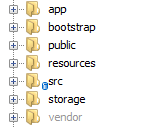
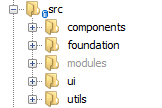

# Files Structure  

[TOC]

## Introduction  
 
The system has been designed on the basis of **HMVC** architectural pattern which stands for Hierarchical - Model - View - Controller. This type of architecture can be described with the use of the following graph:

  
  
The above mentioned graph describes:

* **C** - controller - the layer responsible for transforming (translating) of the request coming from the browser into the presentation which will be displayed in the browser. An example of controllers operation is redirection to the specific URL after the login or display of form's bugs. The controller communicates with model (M) and sends the data to the view (V)

* **M** - model - a layer responsible for processing and delivering the data to view on the basis of data coming from the controller. The model usually is identified with the table in data base.

* **V** - view - a layer responsible for presentation's preparation, i.e. generation of html which will be displayed in the browser. The view may be conditioned, depending on data coming from the model or the controller itself.

The hierarchy in this type of architecture relies on data exchange between individual layer groups. One layer may (but not necessarily must) transfer the data to the next layer as long as the proper website's content is produced.  

## Filesystem Structure  

Filesystem structure is the following:

  
  
It consists of catalogues divided thematically according to destination:

* **app** - The app directory, as you might expect, contains the core code of your application​ in case you don't want to use [Antares ​​module-driven](components_&_modules.md)​ ​​style​.​ ​Almost all of the classes in your application​ ​should be ​​in this directory

* **bootstrap** - The bootstrap directory contains files that bootstrap the framework and configure autoloading. This directory also houses a cache directory which contains framework generated files for performance optimization such as the route and services cache files

* **resources** - ​The resources directory contains​ ​application​​ views as well as your raw, un-compiled assets such as LESS, SASS, or JavaScript. This directory also houses all of your language files

* **src** - ​The src directory contains source code of Antares core and modules as separated as Laravel packages. More information about creation on [Laravel](https://laravel.com/docs/5.4/) package you may find here

* **storage** - The storage directory contains compiled​ [Twig](https://twig.sensiolabs.org/) templates, file based sessions, file caches, and other files generated by the​ [Laravel](https://laravel.com/docs/5.4/) ​framework​ ​and Antares. This directory is segregated into app, framework, and logsdirectories. The app directory may be used to store any files generated by your application. The framework directory is used to store framework generated files and caches. Finally, the logsdirectory contains your application's log files

* **public** - The public directory contains the index.php file, which is the entry point for all requests entering your application. This directory also houses your assets such as images, JavaScript, and CSS

* **vendor** - The vendor directory contains [Composer](https://getcomposer.org/doc/00-intro.md) dependencies.

### Src directory

Src directory contains:
  
  
  
* **modules** -  Directory contains all external modules to extends base Antares functionality. Modules are a part of application and not required by base system which means that can be shared independently and not interfere with main system work. More information about creating modules you can find [here](../antares_concepts/components_&_modules.md) 

* **core** - Contains github core repository of Antares and includes typical github repo structure. It can be treated as heart of whole application.

### Core directory
 
 Core directory within `src` contains: 
 
   * **docs** - The docs directory contains markdown documentation files and build reports generated by [Travis-ci](https://travis-ci.org/) continuous integration service
    
   * **tests** - The tests directory contains core php unit tests to verify code quality by code coverage
    
   * **src** - Contains source code of Antares:
    
       
       
       * **components** - This directory contains the main parts (services) of Antares Core, such as: acl, area manager, installer etc.  Information about details of how they work you find in section named "Services". Director contains following tools:
           
           * **html** - contains the tools assisting in html design
           * **acl** - contains functions to control the users' access to resources (endpoints)
           * **area** - contains functions which enabling applications division into access layers, depending on a group and the rules assigned to a single user
           * **auth** - supporting users' authorization and authentication to system
           * **composer** - pre and post installation scripts executing when application is installing by composer
           * **console** - supporting the commands in Laravel scheduler's
           * **extension** - extensions (components and modules) manager
           * **html** - contains helpers and tools for html design
           * **installer** - system's installer
           * **kernel** - contains extended Laravel classes
           * **messages** - flash messages(short duration messages - to the next request) manager 
           * **model** - contains main data base business models used by the system
           * **notifier** - sending notifications to system's users
           * **publisher** - supports execute components' and modules' migration files                                                              
       
       * **foundation** - Contains all of required php classes which are used while application booting. It has base application config files with information about default system notifications and settings (such as email templates and configuration, default system groups and roles). 
       It also includes default system [acl configuration](../services/auth_and_acl.md), [translations](../services/translator.md), system [routes](../modules_development/routing.md), [events](../services/events.md) and many more. Mainly, brings together other core components and services as ingredients to delivery one, connected, working package to use with external modules.
       
       * **modules** - As the name suggests, it contains core modules which not interfere with foundation. There are few modules within this directory which are required by Antares:      
       
           * [automation](../core_modules/automation.md) - is used to execute cyclic operation based on scheduler,           
           * [control](../core_modules/control.md) - a lightweight role-based permissions module for Antares,           
           * [logger](../core_modules/logger.md) - responsible for gathering the logs coming from different parts of the system,           
           * [notifications](../core_modules/notifications.md) - used in order to execute the process of sending notifications to end users           
           * customfields - provides possibility to create system custom fields to extend default entity attributes           
           * tester - provides possibility to verify(test) configuration in various sections          
           * [translations](../core_modules/translations.md) - manage Antares translation files           
           * [updater](../core_modules/updater.md) - provides information about present system's state, which facilitates application's update and reports' generation concerning system's state.
           
       * **ui** - Contains various classes responsible of application presentation (user interface - ui). It has two different packages:
            
           * [base](../antares_concepts/ui_structure.md) - provides base system ui elements, such as breadcrumbs, menus, panes, placeholders, navigation features etc., which are used within main layout template.              
           * [components](../modules_development/views_and_ui_components.md) - provides system ui components which can handle every type of data produced by any module and displays it on the content block of main layout template.
                    
       * **utils** - Contains various classes responsible of application presentation (user interface - ui). It has two different packages:
            
           * **asset** - functions connected with presentation layer's management, especially javascript and css files. The auxiliary library is [assetic framework](https://github.com/kriswallsmith/assetic) which is fully supported in designing and optimization js and css source code                    
           * **breadcrumb** - system navigation manager. [Click here](https://github.com/davejamesmiller/laravel-breadcrumbs) to see what it uses as a helping vendor           
           * **datatables** - supports building the datagrids, using the popular library [Datatable](https://datatables.net/) and [vendor](http://datatables.yajrabox.com)           
           * **date** - date formatters        
           * **form** - helpers for building personalized forms           
           * **geoip** - geolocation library. It uses [geoip](https://github.com/Torann/laravel-geoip)
           * **registry** - implementation of the registry design pattern as a base class for extending by the components and modules
           * **security** - implementation of the solutions increasing system's protection           
           * **testbench** - an environment for create unit tests based on [Orchestra Testbench](https://github.com/orchestral/testbench).            
           * **testing** - an environment of unit tests built for working with application's simulation mode                      
           * **translation** - assistance in translation           
           * **twig** - extensions of the twig engine           
           * **url** - url generator connected with acl
                      
  > Any interference of content of files within core directory may make the system unstable.
       
        