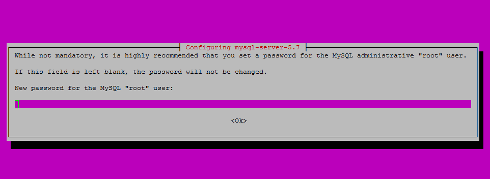
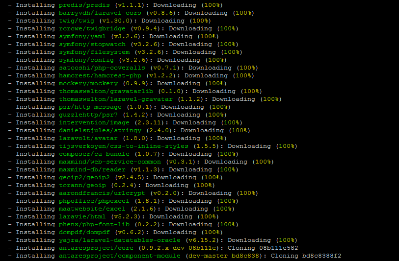

# Automatic Installation Guide

Before the installation, it is worth to make sure that all environment's components have been installed in versions compatible with the [expected](requirements.md) ones.  

Follow the steps below to install Antares Project successfully.  Find here precise instruction on how to install your Antares and how to configure it later on.

* In order to install your Antares Project, log into your Console as a Super-User and proceed to `/var/www` directory:

```bash
cd /var/www
```
   
If directory not exists, create it:
```bash
mkdir -p /var/www
```

* Automatic installation is based on a script. You can download installer script from following [location](https://raw.githubusercontent.com/antaresproject/installer/master/installer.sh):

```    
https://raw.githubusercontent.com/antaresproject/installer/master/installer.sh
```
It is recommended to place installer script into `/var/www` server directory.

Run the command:

```bash
sudo bash installer.sh
```


* During that process some questions will be asked, please read them and answer carefully.  It will allow perfect adjustment of your new Antares Project to your demands.



*  All the system dependencies required for correct functioning of Antares application are going to be installed.
    Please be patient as the time required to finish the installation process of the packages depends on your network speed.



* Configure the database for Antares Project
  
    
    
* Proceed to: `http://Your IP Address/install` do continue components and modules installation.


* The application is ready to work.
