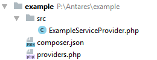

# Module Base

[TOC]

This article will help you understand how modules in Antares are designed and what should include. It will help you create your own modules. If this is your first try with Antares, we highly recommend to follow the  [Sample Module Tutorial](../tutorials/sample_module.md).

## Minimal Structure
  
Every module must consist of the following structure:


  
 
### composer.json schema

We recommend that you should fill the ```composer.json``` file with additional information.

```json
{
  "name": "antaresproject/module-example",
  "description": "Antares Example Module",
  "type": "antaresproject-module",
  "homepage": "http://your-module.website",
  "version": "0.9.2.1",
  "authors": [
    {
      "name": "Your Name",
      "email": "your@contactemail.io"
    }
  ],
  "require": {
    "antaresproject/component-installer-plugin": "*"
  },
  "autoload": {
    "psr-4": {
      "Antares\\Example\\": "src/"
    }
  },
  "extra": {
    "friendly-name": "Example Module"
  }
}
```

Required attributes:

* **name** - determines the name - identifier of a module in a repository. Just like the regular composer package, the name must be in `<vendor>/<package name>` format. The important is that, the last part of name must be prefixed by ```module-``` word.
* **type** - a special type for composer package which determines how the module must be installed in the system.
* **version** - the version of package.
* **authors** - an array of collaborators' names and emails. At least one author must be presented.
* **require** ```antaresproject/component-installer-plugin``` - required package which allows to install the package in proper way.
* **autoload** - determines to which directory the namespace should be pointed.

Optional attributes:

* **homepage** - the HTTP address to your module homepage. If presents when in the Module page by clicking the module name the URL will be opened in the browser.
* **friendly-name** - must be placed in ```extra``` attribute. In the modules page, the name will be overridden by the given value.

A full description of the composer.json structure can be found [here](https://getcomposer.org/doc/04-schema.md).


### Service Providers

**providers.php** file's content:

```php
<?php

return [
    \Antares\Modules\Example\ExampleServiceProvider::class,
];

```

In this file must be an array with service providers which are required to run module in the application. At least one service provider must be declared with a content as below:

Service provider's file structure:

```php
<?php

namespace Antares\Mdoules\Example;

use Antares\Foundation\Support\Providers\ModuleServiceProvider;
use Illuminate\Routing\Router;

class ExampleServiceProvider extends ModuleServiceProvider
{
    
}
```

In the above mentioned example service provider must inherit from the class `ModuleServiceProvider`.

## Dedicated Configuration

You can consider that the module should has its dedicated configuration which can be rewritten or just used to fetch some information. For example API HOST with possibility of end-point customization. 
Instead of storing this data in regular config file or as hardcoded, you can create a dedicated file named ```settings.php``` and place in inside the ```resources/config``` path in the module root directory. 
The file looks like other configuration files, so it returns an array just like example below.

```php
<?php

return [
    'data' => [
        'email'  => '',
        'how_many' => 10,
    ],
    'rules' => [
        'email' => 'required|email',
        'how_many' => 'required|integer'
    ],
    'phrases' => [
        'email.required' => 'Oh no! You forgot give us your email :(',
    ],
];
```

* **data** - this array stores settings of the module. Must be provided in the ```key => value``` format, where a value is always a default one.
* **rules** - (optional) Laravel's way validation rules used by the form.
* **phrases** - (optional) Laravel's way validation phrases used as the messages for failed validation.

To access to the interested data, you can use IoC:

```php
<?php

use Antares\Extension\Manager;

class SomeClassExample {

    protected $manager;

    public function __construct(Manager $manager) {
        $this->manager = $manager;
    }
    
    public function getEmail() {
        return $this->manager->getSettings('antaresproject/module-example')->getValueByName('email');
    }
    
}
```

Or by used Facade.

```php
<?php

use Antares\Extension\Facade\Extension;

class SomeClassExample {
    
    public function getEmail($default = null) {
        return Extension::getSettings('antaresproject/module-example')->getValueByName('email', $default);
    }
    
}
```

Ok, so we can create a dedicated file for that, but why not to use a regular config file instead? 
The reason is that you can like to have a form page for that data but without wasting time to build that. 
This is why in the example there are also arrays of rules and phrases, which are automatically used by the validation.

#### How to build a dedicated Configuration Form?

Inside the module src path create a ```SettingsForm.php``` file in ```Config``` directory.

```php
<?php

namespace Antares\Modules\Example\Config;

use Antares\Contracts\Html\Form\Fieldset;
use Antares\Extension\Contracts\Config\SettingsContract;
use Antares\Extension\Contracts\Config\SettingsFormContract;

class SettingsForm implements SettingsFormContract {

    /**
     * Builds the content of the settings form.
     *
     * @param Fieldset $fieldset
     * @param SettingsContract $settings
     * @return mixed
     */
    public function build(Fieldset $fieldset, SettingsContract $settings) {
        $fieldset->control('input:text', 'email')
            ->value( $settings->getValueByName('email') )
            ->label('Your e-mail address');

        $fieldset->control('input:text', 'how_many')
            ->value( $settings->getValueByName('how_many') )
            ->label('How many times you would like to use it?');
    }

}
```

The class must implement the ```SettingsFormContract``` interface. Inside the ```build``` method your can build the form (within fieldset) using it in regular way. And it is done! The form will be created dynamically and it will handles validation based on your settings in your ```settings.php``` file. Access to the form will be available within the components page.

#### What about custom form?

If you have already created form for the module and want to use it within the modules page instead of the automatically built, you should open the ```settings.php``` file and add an extra key.

```php
<?php

return [
    'data' => [
        'email'  => '',
        'how_many' => 10,
    ],
    'custom_url' => 'url/to/your/page/where/is/form',
];
```

If the ```custom_url``` is presents and the value is not empty, your can safety remove ```rules```, ```phrases``` and ```SettingsForm``` file because they will be not used anymore. 
The value of that key must be URL to the page, where should be a form placed.